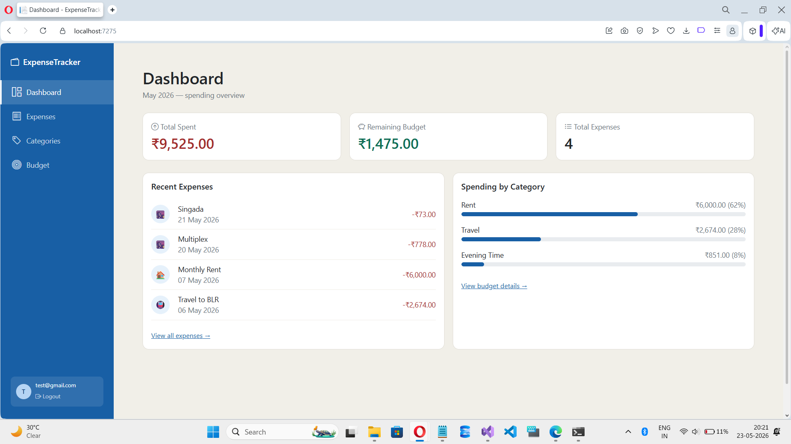
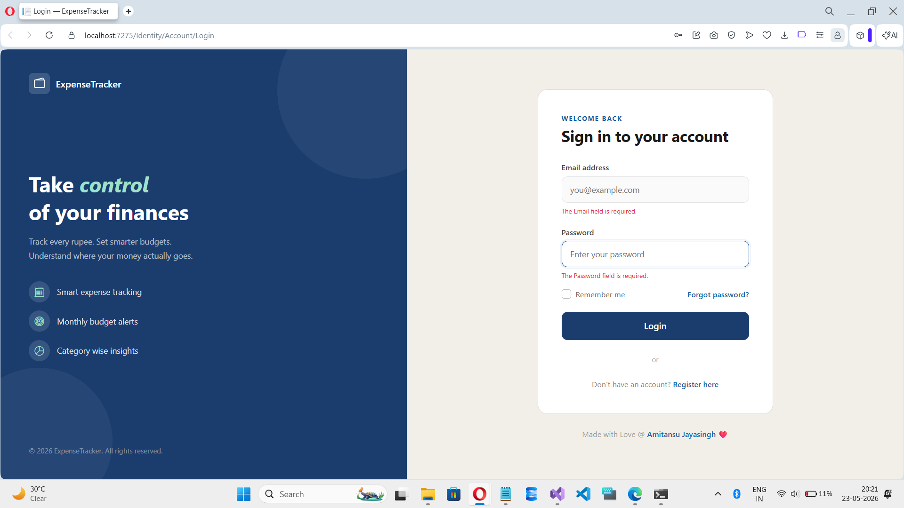
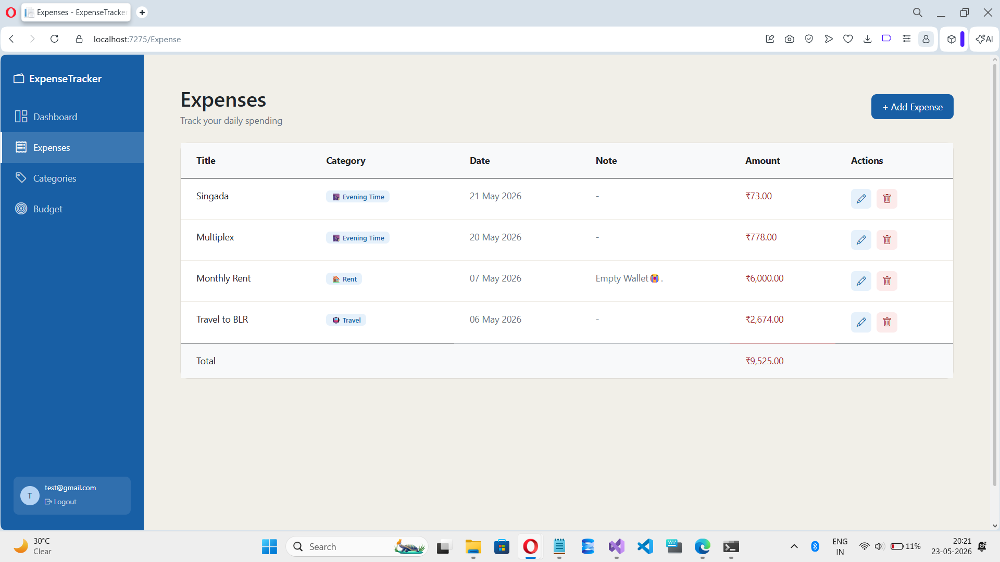

# 💰 Expense Tracker

A full-stack personal finance web application built with **ASP.NET Core 8 MVC** 
and **SQL Server** to track expenses, set budgets, and analyze spending patterns.

---

## 🖥️ Live Preview



---

## ✨ Features

- 🔐 User Authentication — Register, Login, Logout
- 📊 Dashboard — Real time spending overview
- 💸 Expense Tracking — Add, Edit, Delete expenses
- 🏷️ Categories — Organize expenses with emoji icons
- 🎯 Budget Management — Set monthly limits with progress bar
- ⚠️ Smart Alerts — Warnings at 70% and 90% spending
- 👤 Multi-user — Each user sees only their own data

---

## 🛠️ Tech Stack

| Layer | Technology |
|-------|-----------|
| Framework | ASP.NET Core 8 MVC |
| Language | C# |
| Database | SQL Server |
| ORM | Entity Framework Core 8 |
| Authentication | ASP.NET Core Identity |
| Frontend | Razor Views + Bootstrap 5 |
| Icons | Bootstrap Icons |

---

## 🚀 Getting Started

### Prerequisites
- Visual Studio 2022
- .NET 8 SDK
- SQL Server / SQL Server Express

### Installation

1. **Clone the repository**
git clone https://github.com/amitansu-jayasingh/Expense-Tracker.git

-----

2. **Open in Visual Studio 2022**

3. **Update connection string in `appsettings.json`**
```json
   "ConnectionStrings": {
     "DefaultConnection": "Server=YOUR_SERVER;Database=ExpenseTrackerDb;
      Trusted_Connection=True;TrustServerCertificate=True;"
   }
```

4. **Run database migrations**
Update-Database

----
5. **Run the application**
Ctrl + F5
----

---

## 📸 Screenshots

### Login Page


### Dashboard


### Expenses


---

## 📁 Project Structure

ExpenseTracker/
├── Controllers/
│   ├── DashboardController.cs
│   ├── ExpenseController.cs
│   ├── CategoryController.cs
│   └── BudgetController.cs
├── Models/
│   ├── Expense.cs
│   ├── Category.cs
│   └── Budget.cs
├── Data/
│   └── AppDbContext.cs
├── Views/
│   ├── Dashboard/
│   ├── Expense/
│   ├── Category/
│   └── Budget/
└── Areas/
└── Identity/
└── Pages/
└── Account/

---

---

## 👨‍💻 Developer

Built with ❤️ by [Amitansu Jayasingh](https://github.com/amitansu-jayasingh/amitansu-jayasingh)

> *"Started this project to learn .NET Core and fulfill my dream 
>   of becoming a software developer."* 🚀

---

## 📄 License

This project is open source and available under the [MIT License](LICENSE).